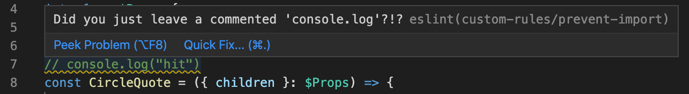

# eslint-plugin-facepalm

Do you get reviewers who tell you that these is a commented `console.log`?

Do you feel like facepalm is the only response you can give?

Do you want to stop submitting these silly code issues?

### Why

I made this little plugin because I keep leaving `// console.log(item)` in my code. I'm not saying they are wrong but its little annoying. It just does not make for clean code.

## How to use

### Install

```
yarn add @michaelkramer/eslint-plugin-facepalm --dev
```

#### Config

```
"eslintConfig": {
    "plugins": [
      "@michaelkramer/eslint-plugin-facepalm"
    ],
    "rules": {
      "@michaelkramer/facepalm/no-comment-console": "warn"
    }
}
```


