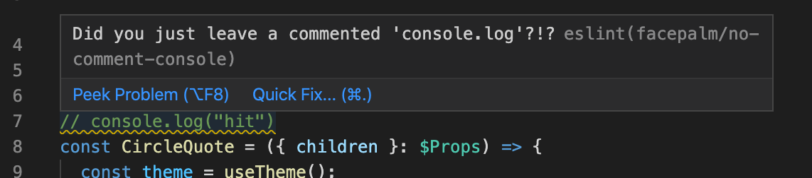

# eslint-plugin-facepalm

[](https://www.npmjs.com/package/@michaelkramer/eslint-plugin-facepalm)
[](https://www.npmjs.com/package/@michaelkramer/eslint-plugin-facepalm)

Do you get reviewers who tell you that these is a commented `console.log`? 🤦

Do you feel like facepalm is the only response you can give? 🤦

Do you want to stop submitting these silly code issues? 🤦

### Why

I made this little plugin because I keep leaving `// console.log(item)` in my code. I'm not saying they are wrong but its little annoying. It just does not make for clean code.

## How to use

### Install

```
yarn add @michaelkramer/eslint-plugin-facepalm --dev
```

#### Config

```
"eslintConfig": {
    "plugins": [
      "@michaelkramer/eslint-plugin-facepalm"
    ],
    "rules": {
      "@michaelkramer/facepalm/no-comment-console": "warn"
      "@michaelkramer/facepalm/no-useless-comments": "warn"
    }
}
```



## Rules

#### no-comment-console

This reports if you leave `// console.log` in the code.

#### no-useless-comments

This reports if you leave `// const a = b` in the code.
This looks for any of the javascript reserved words.

Examples:

- `// for (var i = 0; i < a.length; i++) {`
- `// while (a < b.length)`
- `// with(MATH)`
- `// do {`
- `// this.setStatus()`


[](https://www.buymeacoffee.com/CVtZwWc)
